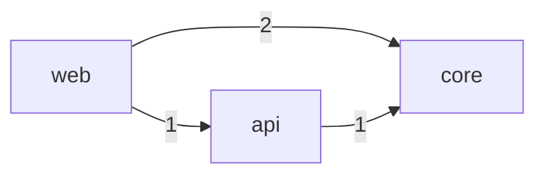

# Codebase → architecture knowledge

Turn a repo into an architecture wiki + engineer profiles. The repo is **not** copied into `.raw/`; it's scanned in place and registered by path so `update` can detect new commits.

## 1. Scan
```bash
python3 "<vault>/.kb/bin/kb_repo_scan.py" --path "<repo>" --out "<vault>/<KB>/.raw/_scan-<repo>.json"
python3 "<vault>/.kb/bin/kb_manifest.py" record-repo --kb "<KB dir>" --name "<repo>" --path "<repo>"
```
The JSON has: `languages`, `structure` (top-level dirs + role guess), `entry_points`, `dependencies` (external, per manifest file), `internal_edges` (module→module import edges), `contributors`, `hotspots`, `ownership` (top author per dir), `recent_commits`, plus `remote`, `head`, `branch`, `loc_total`.

Always read the repo's `README` and any `docs/`, `ARCHITECTURE.md`, or ADRs too — the scan gives structure; the prose gives intent.

## 2. Notes to create (depth = `codebase_depth` in config)

### `Architecture/<Repo> Overview.md` (always — Title-Case capitalised filename)
What the system is and does (from README + entry points), primary languages (`languages`), the top-level layout (`structure`), how to run it (`entry_points`), and external dependencies (`dependencies`). Link the repo `remote`/path. Note `loc_total` and `branch`/`head` for reference.

### `Architecture/<Repo> Dependencies.md` (always)
A Mermaid graph from `internal_edges`. Each edge `{from,to,weight}` becomes an arrow; use weight to annotate. Example:
````markdown

````
Also list external dependencies grouped by manifest file. Flag cycles if `internal_edges` show mutual arrows.

### `Architecture/<Module>.md` — one per significant top-level dir (always at `architecture`+ depth)
Responsibilities (infer from name/`role` + contents), what it imports and what imports it (from `internal_edges`), key files, and **owners** (link the engineers from `ownership[dir]`). Use the `architecture.md` template.

### Deep (`codebase_depth: deep`)
Add public API / key functions per module, important data models (consider a Mermaid `erDiagram` for schemas/models), and notable flows as Mermaid `sequenceDiagram`s.

### Light (`codebase_depth: light`)
Overview + structure + entry points only. Skip per-module notes.

## 3. Engineer profiles & ownership
From `contributors` (deduped by name/email — see people-extraction), create/update `People/` notes with `role: engineer`: commit count, active date range (`first`→`last`), and approximate volume (`insertions`/`deletions`). From `ownership`, write a "who owns what" section linking each engineer to the modules they edit most. From `hotspots`, note the most-churned files (likely complexity/risk) in the overview.

## 4. Architecture graph for Obsidian
The per-note Mermaid graphs render inline. The vault graph view *also* lights up because module notes link to each other and to owners — so you get both a precise diagram and an emergent graph. Optionally add a `Canvas/` board pinning the overview + module notes for a visual map.

## 5. Update behavior
On `update`, if the repo HEAD moved: re-scan, refresh the overview's head/branch, add new contributors, update ownership/hotspots, and reconcile the dependency graph if modules were added/removed. Don't rewrite unchanged module notes — just bump `updated:`.
