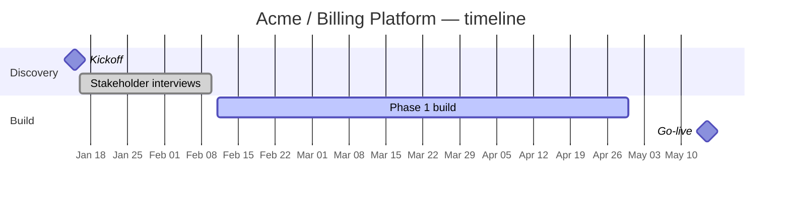
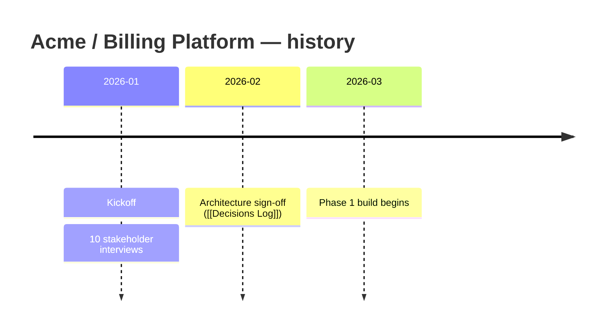
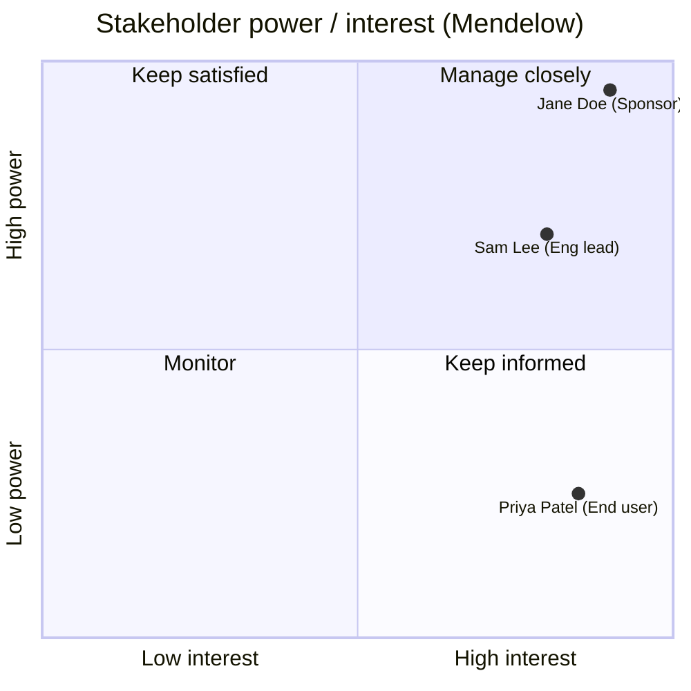
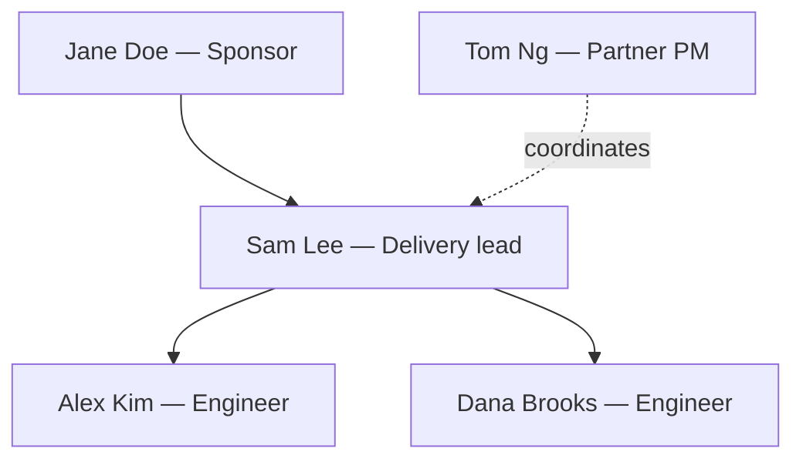

# Visuals — the graphs that make a KB legible at a glance

A KB should *show*, not just tell. Most readers (account managers, PMs, sponsors) take in a
picture faster than prose. Every build should produce the relevant visuals below. They are
all **Mermaid** (renders inline in Obsidian, no plugin) or the core **graph view** — so they
work in a zero-plugin vault. Keep them **grounded**: every node/bar/point comes from a source;
never invent people, dates, or milestones (unknowns → `questions.md`).

Catalog: **timeline (gantt)** · **timeline (events)** · **Stakeholder Map (quadrant)** ·
**People Relationships (graph)** · **dependency graph** (see `../../kb-architecture/references/codebase-pipeline.md`).

---

## 1. Project timeline — Gantt (phases & milestones)
Use for an engagement with phases/dates. Owned/refreshed by **kb-timeline**; pin it in the
KB `_index.md` "Meetings (timeline)" section and link it from `Overview.md`. Bars come from
dated meetings/decisions and any stated phase dates; milestones (`:milestone`) for key dates.

````markdown

````

## 2. Project history — Timeline (event stream)
Use when there are events without clean start/end ranges (a stream of meetings/decisions).
Lighter than a Gantt; good for "what happened when".

````markdown

````

Pick **one** primary timeline per KB (Gantt if dated phases exist, else event timeline). Don't
ship both unless the user asks.

---

## 3. Stakeholder Map — Mendelow quadrant
Owned/refreshed by **kb-people**. A power × interest grid so a reader instantly sees who to
**manage closely** vs **keep informed**. Place at the top of `Stakeholder Map.md`; link every
plotted person `[[Name]]` in a list below the chart. Coordinates are a judgement read of the
sources (power = influence/seniority; interest = how engaged they are) — reasonable, not exact;
if you can't place someone from the sources, list them under "unplaced" rather than guessing.

````markdown

````
Quadrant geometry: **Q1** top-right (high power, high interest) = Manage closely · **Q2**
top-left = Keep satisfied · **Q3** bottom-left = Monitor · **Q4** bottom-right = Keep informed.
Points are `[interest, power]`, each 0–1.

---

## 4. People Relationships — working-network graph
Owned/refreshed by **kb-people** (also emerges in the core graph view from co-attendance/links).
A directed graph of reporting lines and working relationships in `People Relationships.md`.

````markdown

````

---

## Rules (all visuals)
- **Grounded** — every element traces to a source; no invented names/dates/milestones.
- **Short labels** — keep node/bar text terse; put detail in the linked note, not the diagram.
- **ISO dates** (`YYYY-MM-DD`); Gantt `dateFormat YYYY-MM-DD`.
- **Link out** — under every diagram, list the entities as `[[wikilinks]]` so the graph view and
  backlinks still work (a Mermaid diagram is a picture, not a link source).
- **Validate it renders** — Mermaid syntax errors show as a broken block in Obsidian. Quote any
  label containing spaces/punctuation (`"Jane Doe (Sponsor)"`). Re-check after editing.
- **Refresh on update** — these are regenerated by their owning skill on each `update`, not left stale.
